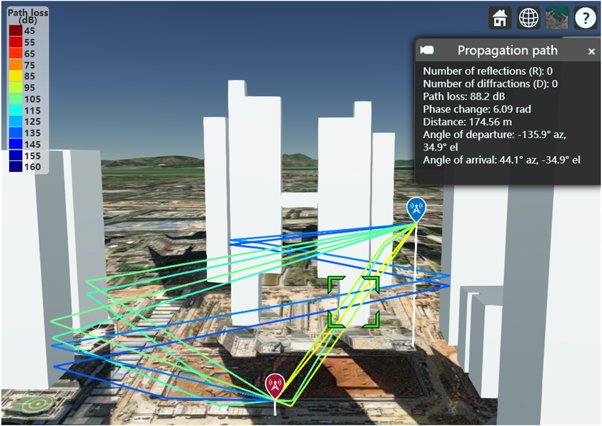

# ray-tracing

The scenario for ray tracing.  

# Introduction
A software for ray tracing based on MATLAB ray tracing [toolbox](https://www.mathworks.com/help/comm/ref/rfprop.raytracing.html)  
map file can be downloaded from [Open Street Map](https://www.openstreetmap.org)  
ray_tracing1.0 folder is for static scenarios  
ray_tracing2.0 folder is for dynamic scenarios  
main.py is main function for CSI generation  
parameter.py is to set parameters for the system  
generate.py is to generate CSI  
dji.osm is the map file  

# Author
[Bin Yang](https://scholar.google.com/citations?user=_v2KA7UAAAAJ&hl=zh-CN) Email: binyang_2020@163.com  

# Reference
[1] [DeepMIMO](https://github.com/DeepMIMO/DeepMIMO-matlab)  
[2] [5G-NR-data-generato-main](https://github.com/CodeDwan/5G-NR-data-generato)   
